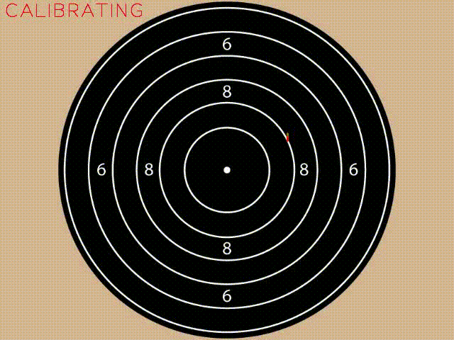
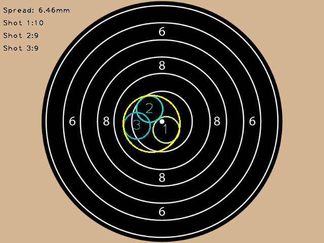

# Splatt - a DIY target shooting trainer

<i>What it looks like (a few versions ago) in action</i>

## Introduction
This is an attempt to build a DIY target shooting trainer. It is based on the idea of using a webcam to track a bright spot, and using where this bright point is located on the image generated to estimate where a rifle (or other object) is pointing.

The intended use-case for the system is a webcam mounted on the barrel of the rifle, and using an LED in the vicinity of an aiming mark to detect the rifle's aiming point.

It could also be used with a static webcam, pointing at a wall, say, and a laser mounted on or in the barrel to generate a moving reference point.

## Features

Auto-calibration of aiming mark vs reference point using a configurable number of 'shots' to average against.

Fine-tuning of calibration at any time

Virtual shooting range configurations for different distances and disciplines

Indicator to show target is acquired (red) and in the bull scoring ring (green)

Audio-detection of the 'shot' with configurable threshold for dry and live firing.

Auto-reset of target after the shot is taken for hands-free operation

Composite picture showing all shots taken in a session, with spread analysis

Save videos and images of the shots taken for further analysis

Configurable flip of the captured image (for when the webcam is mounted upside down)

Undo last shot, in case of false detections

Automatic scoring of shots based on shot location and scoring ring diameters

Pause and resume firing (prevents shot detection while paused)

Shot timer in 'live firing' mode

## Planned features

Auto-saving of shot trace static and video images with filename based on session name and date/time

Further analyses of shot performance and data export

## Requirements

Decent-ish machine with Python 3 installed (tested on Windows)

The following Python libraries installed: Numpy, OpenCV-Python, SoundDevice

Webcam, ideally with a built-in microphone. Depending on the light source used, a cheap one that is sensitive to Infra Red light is useful, or a better one with its IR filter removed and a visible light filter added.

Point light source, eg either a visible or IR LED. CR2032 batteries can power a LED directly, or a 2xAA batter holder with a ~480R resistor in series with the LED. If you're feeling adventurous you can try using a joule thief, but I found the one I made didn't drive IR LEDs.

Some way of attaching either the webcam or laser source to the firearm being used.

## Rough notes on installation:

Install  python3 and pip, depending on your OS and distribution

pip install numpy

pip install opencv-python

pip install sounddevice

## Usage (Draft)

Edit config.py to suit your hardware and shooting requirements, notably:

video_capture_device - 0 is usually any built-in webcam, 1 is usually the first USB one (in Windows)

Virtual Range settings - set 'real' distance between you and your target, as well as the 'virtual' distance between

Create an aiming mark. For NSRA smallbore targets, the diameter of the mark in mm is 2.055 times the distance in yards between you and the target.

Setup your webcam and point light source according to how you wish to use the system (see below for my prototype).

Start Splatt with

    python Splatt.py

Wait for it to initialise

Aim at the target and shoot a suitable number of calibration shots

Use the 2, 4, 8 and 6 keys to fine-tune the calibration down, left up and right respectively

Aim away from the light source while reloading / re-cocking to avoid spurious shot detections

After the calibration shots have been completed press enter to start shooting mode - the calibration offset and scaling of movement will be applied.

Continue to shoot as required. Pause and resume the shot detection by pressing 'P'.

Various functions can be used while the system is in use by pressing the following keys:

Space - Remove last shot

Enter - End the calibration process and begin 'live' shooting (enables scaling)

C - Clear the composite shots taken so far

D - Change debug level

F - Toggles whether to flip the image for cameras mounted upside-down

P - Pause / unpause (ignore any noises that might be interpreted as as shot)

Q - Quit

R - Reset and begin again from scratch (restart calibration process)

S - Save the composite image (static filename at the moment; on the to-do list)

V - start/stop video recording (static filename at the moment; on the to-do list)

2 - Adjust the calibration down

4 - Adjust the calibration left

6 - Adjust the calibration right

8 - Adjust the calibration right

7 - Decrease the virtual range length one unit (fine tuning)

9 - Increade the virtual range length one unit (fine tuning)

## Disclaimer

Use at your own risk. The author accepts no responsibility for the use or misuse of this system. Never fire live rounds except on an authorised range, following all safety regulations.

Don't point lasers into your eyes either.

Apologies for the quality of this readme. It will improve as time goes on!

## Images

Prototype Webcam arrangement

Example composite output
